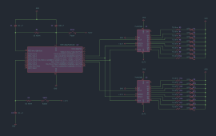
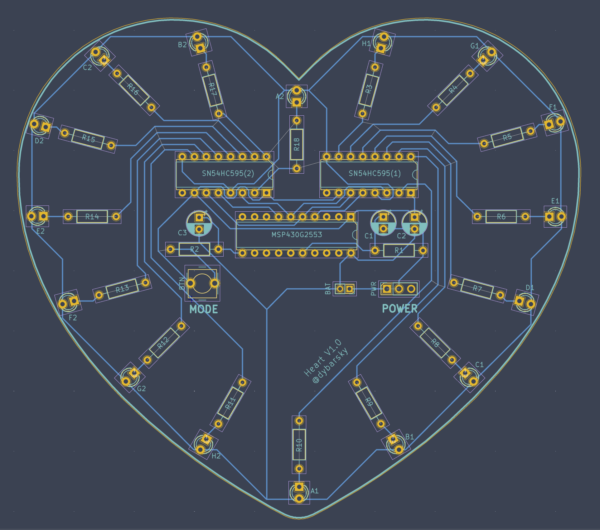
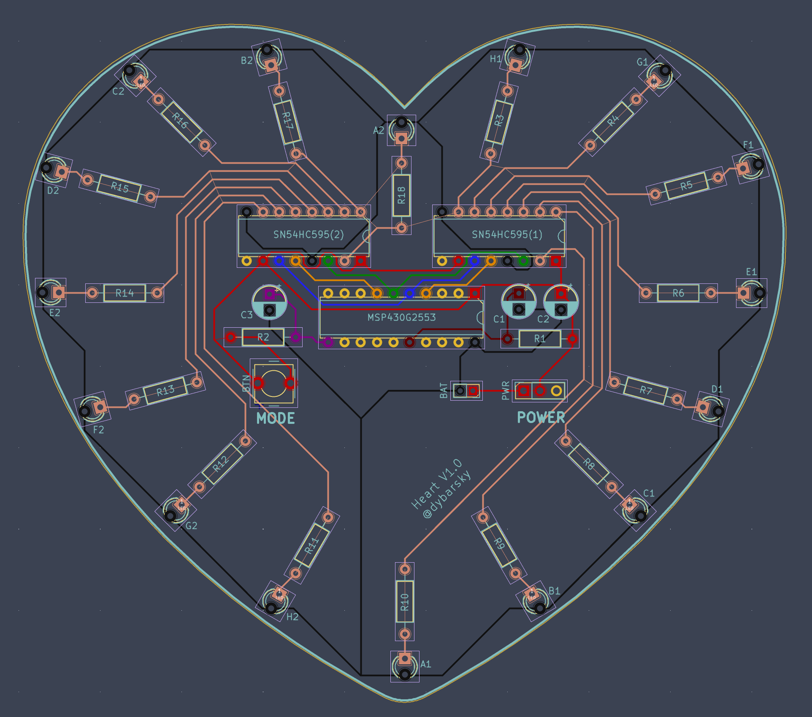

## HEART LEDs Valentine's day gift.
An Open Source & Open Hardware project.  

_Demo gif (loads a bit long)_ 👇  

## Parts
The core of this project is `MSP430G2553` mictrocontroller by Texas Instruments and two `SN74HC595N` 8-bit shift registers. Each 8-bit shift register controls 8 3mm red LEDs. Also resistors, capacitors, slide switch, tacticle button, DIP sockets, Li-ion akku 3.7V, a JST connector.  

Check schematics below to get values for resistors and capacitors.  

Here are all used components 👇  

And this is how assembly looks like 👇  

## Schematic
I used KiCad to design hardware. Source files are located in `pcb` folder.  
This is a schematic diagram 👇

## PCB Design
KiCad project fies for PCB as well as Gerber files for PCB production are also located in `pcb` fodler.  
This is a PCB design 👇  

With highlighted nets 👇  

## Firmware
Firmware for this project was written in vanilla `C`, operating with IC registers directly (without platformio or any other ports of arduino libraries). It requires some deeper knowledge of MSP430G2553 datasheet and hardware communication protocols, but drastically reduces binary size. It's only 14 KB!  

There are 6 different patterns of LEDs blinking. They are store in 2 dimensional arrays of bytes.  
Timer intrruptions are configured to be called every 0.1 second. IC goes over array and sends data to 8-bit shift register. Communication between the microcontroller and 8-bit shift registers is done via `SPI` protocol. When IC is not busy, it goes to low power mode.

## Demo
https://www.youtube.com/watch?v=liG8lNvPkbY

## Instrucitons 
Coming soon...
